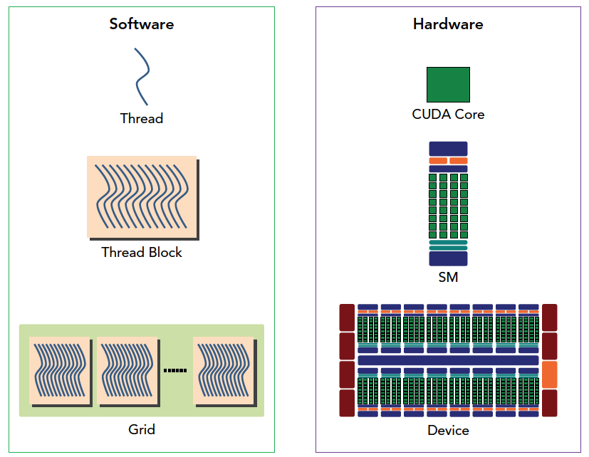
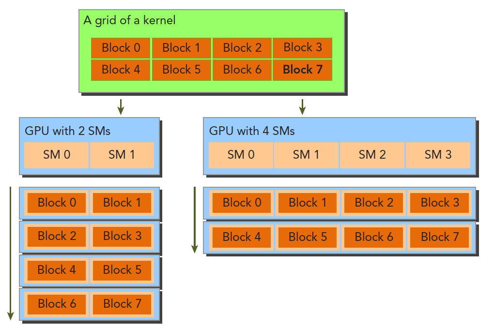
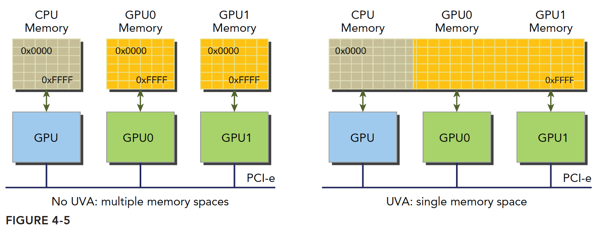
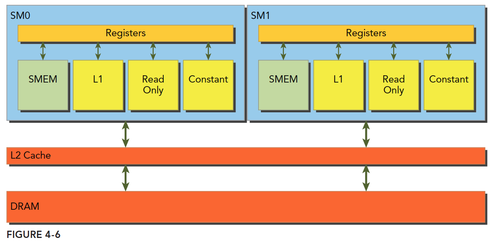
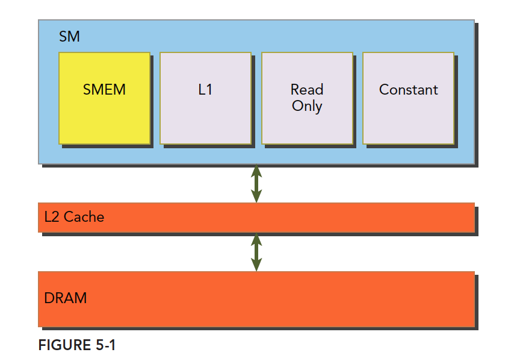
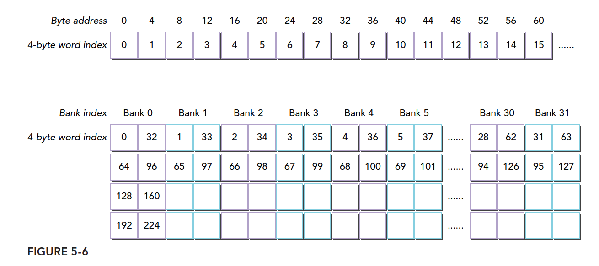
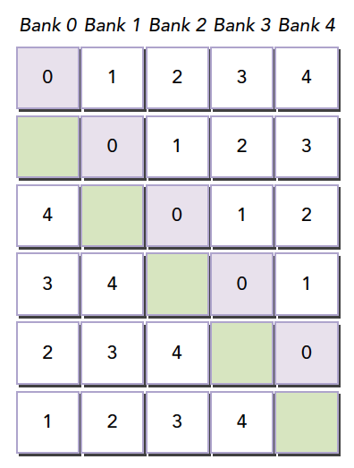
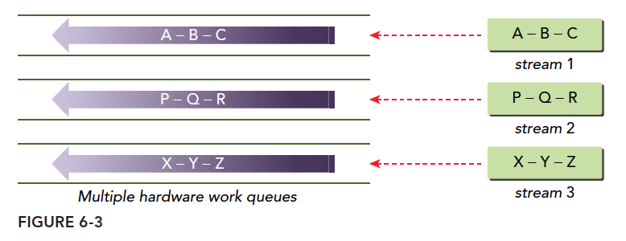

# CUDA C 权威编程指南

## 目录

[第 1 章 基于 CUDA 的异构并行计算](#第-1-章-基于-cuda-的异构并行计算)  
[第 2 章 CUDA 编程模型](#第-2-章-cuda-编程模型)  
[第 3 章 CUDA 执行模型](#第-3-章-cuda-执行模型)  
[第 4 章 全局内存](#第-4-章-全局内存)  
[第 5 章 共享内存和常量内存](#第-5-章-共享内存和常量内存)  
[第 6 章 流和并发](#第-6-章-流和并发)  
[第 7 章 调整指令级原语](#第-7-章-调整指令级原语)  
[第 8 章 GPU 加速库和 OpenACC](#第-8-章-gpu-加速库和-openacc)  
[第 9 章 多 GPU 编程](#第-9-章-多-gpu-编程)  
[第 10 章 程序实现的注意事项](#第-10-章-程序实现的注意事项)

## 第 1 章 基于 CUDA 的异构并行计算

CPU 有处理复杂逻辑和指令级并行性的能力；GPU 中有大量可编程的核心，可以支持大规模多线程运算，而且相比 CPU 有较大的峰值带宽。

- CPU：较小的数据规模、复杂的控制逻辑、很少的并行性；
- GPU：较大规模的待处理数据、大量的数据并行性。

构建 GPU 应用程序的方法是使用 CUDA 工具包，包括编译器、数学库，以及调试和优化应用程序性能的工具等。

## 第 2 章 CUDA 编程模型

一个典型的 CUDA 程序实现流程遵循以下模式：

1. 为 GPU 分配内存；
2. 将数据从 CPU 内存拷贝到 GPU 内存；
3. 调用核函数操作 GPU 内存中的数据；
4. 将数据从 GPU 内存拷贝到 CPU 内存；
5. 释放 GPU 内存。

### 内存管理

| 标准的 C 函数 | CUDA C 函数 |
| ------------- | ----------- |
| malloc        | cudaMalloc  |
| memcpy        | cudaMemcpy  |
| memset        | cudaMemset  |
| free          | cudaFree    |

函数原型：

```c
// cudaMalloc
cudaError_t cudaMalloc(void **devPtr, size_t size);
// cudaMemcpy
cudaError_t cudaMemcpy(void *dst, const void *src, size_t count, cudaMemcpyKind kind);
/*
复制方向由kind指定：
    cudaMemcpyHostToHost
    cudaMemcpyHostToDevice
    cudaMemcpyDeviceToHost
    cudaMemcpyDeviceToDevice
    cudaMemcpyDefault
*/
// cudaMemset
cudaError_t cudaMemset(void *devPtr, int value, size_t count);
// cudaFree
cudaError_t cudaFree(void *devPtr);
```

### 核函数

函数类型限定符

| 限定符       | 执行         | 调用                  | 备注                                                               |
| ------------ | ------------ | --------------------- | ------------------------------------------------------------------ |
| `__global__` | 在设备端执行 | 可从主机端/设备端调用 | 必须有一个 void 返回类型                                           |
| `__device__` | 在设备端执行 | 仅能从设备端调用      | **device**和**host**可以同时使用，函数会在主机和设备端都进行编译。 |
| `__host__`   | 在主机端执行 | 仅能从主机端调用      | 可以省略                                                           |

用`__global__`修饰符定义核函数：

```c
__global__ void kernelFunction(int *array) { ... };
```

核函数通过特殊的语法调用，称为执行配置（execution configuration），指定网格（grid）和块（block）的尺寸：

```cuda
kernelFunction<<<blocks, threads>>>(param);
```

核函数的限制：

- 只能访问设备内存；
- 必须具有 void 返回类型；
- 不支持可变数量的参数；
- 不支持静态变量；
- 显示异步行为。

验证核函数代码时，除了使用调试工具外，还可以：

1. 在核函数中使用`printf`函数；
2. 将执行参数设置为`<<<1, 1>>>`，强制用一个块和一个线程执行核函数，模拟串行执行。

### 错误处理

将`cudaError_t`错误代码转换为人类可读的字符串描述：

```c
const char* cudaGetErrorString(cudaError_t error);
```

可以定义宏函数检查错误：

```c
#define CHECK(call)\
{\
  const cudaError_t error=call;\
  if(error!=cudaSuccess)\
  {\
      printf("ERROR: %s:%d,",__FILE__,__LINE__);\
      printf("code:%d,reason:%s\n",error,cudaGetErrorString(error));\
      exit(1);\
  }\
}
```

## 第 3 章 CUDA 执行模型

### GPU 架构概述

GPU 是围绕着流式多处理器（SM）的可扩展阵列搭建的，SM 的关键组件如下：

- CUDA 核心
- 共享内存/一级缓存
- 寄存器文件
- 加载/存储单元
- 特殊功能单元
- 线程束调度器


### 线程束和线程块

CUDA 采用单指令多线程（SIMT）架构来管理和执行线程，每 32 个线程为一组，被称为线程束（warp）。一个 SM 上在某一个时刻，有 32 个线程在执行同一条指令（有些可以不执行，但是只能空闲，不能执行其他指令）。当一个核函数的网格（grid）被启动时，多个线程块（block）会被同时分配给可用的 SM 上执行。在 SM 上，同一个块内的多个线程进行线程级别并行；而同一线程内，指令利用指令级并行将单个线程处理成流水线。

_注意: 当一个 block 被分配给一个 SM 后，不能被重新分配到其他 SM 上；多个线程块可以被分配到同一个 SM 上。_

SIMT 模型具有 3 个关键特征：

1. 每个线程都有自己的指令地址计数器；
2. 每个线程都有自己的寄存器状态；
3. 每个线程可以有一个独立的执行路径。



_线程块（block）是软件概念，线程束是硬件概念。_


线程块被分配到某一个 SM 上以后，将分为多个线程束，每个线程束 32 个线程，依次在 SM 上执行。在块中，每个逻辑线程有唯一的编号`threadIdx`；网格中，每个逻辑线程块也有唯一的编号`blockIdx`。这些编号是三维地址`dim3`，类似于`t[z][y][x]`，对应的线性地址是：

$tid=threadIdx.x+threadIdx.y×blockDim.x+threadIdx.z×blockDim.x×blockDim.y$

### 资源分配

每个 SM 上执行的基本单位是线程束，已经分配了 SM 资源的线程束称为**已激活**，一旦被激活，这个线程束就不会离开 SM 直至执行结束。每个 SM 上有多少个线程束处于激活状态，取决于以下资源：

- 程序计数器
- 寄存器
- 共享内存

当寄存器和共享内存分配给了线程块，这个线程块处于活跃状态，所包含的线程束称为活跃线程束。活跃的线程束又分为三类：

- 选定的线程束：SM 正在执行的线程束
- 阻塞的线程束：等待执行的线程束
- 符合条件的线程束：准备要执行的线程束（执行所需的资源全部就位）

### 延迟隐藏

GPU 的延迟通常分为两种：

- 算术延迟：10~20 个时钟周期
- 内存延迟：400~800 个时钟周期

当有较多可用的线程束供其调度，这时候可以达到计算资源的完全利用，可以提高并发数，起到隐藏每个指令的延迟的效果。所以，延迟的隐藏取决于活动的线程束的数量，数量越多，隐藏的越好，但是线程束的数量又受到 SM 的可分配资源影响。所以需要寻找最优的执行配置来达到最优的延迟隐藏。


$所需线程束（下界）=延迟×吞吐量$

_吞吐量：指每分钟处理多少个指令。_

### 同步

#### 系统级同步

`cudaDeviceSynchronize()`是一个主机端显式同步函数，用于等待设备上的所有 CUDA 核函数（kernel）执行完成，并将控制权恢复给主机线程。

```c
cudaError_t cudaDeviceSynchronize(void);
```

另外还有隐式同步方法，某些函数会阻塞到设备端执行完，以实现隐式同步。比如内存拷贝函数：

```c
cudaError_t cudaMemcpy(void *dst, const void *src, size_t count, cudaMemcpyKind kind);
```

#### 块级同步

`__syncthreads()`用于实现块内同步，使同一个线程块中的每个线程都必须等待其他线程到达这个同步点。

```c
__device__ void __syncthreads(void);
```

### 并行性



不同设备和算法上，没有一个固定最优的执行参数，需要在几个相关的指标间寻找一个恰当的平衡来达到最佳的总体性能。

### 线程束分化

同一个线程束中的线程，需要执行不同的指令，这叫做线程束的分化。由于一个 SM 只有一个调度器，产生分化的线程只能串行执行，因此条件分支越多，并行性削弱越严重。

要线程束分化导致的性能下降，根本思路是避免同一个线程束内的线程分化。

_很多时候，编译器会优化线程束分化，但是编程时仍然需要考虑分支效率最大化。_

### 展开循环

GPU 没有分支预测能力，每一个分支都会执行，因此 cuda 程序中需要尽量减少分支。通过展开循环来减少迭代次数，增加更多的独立调度指令来提高性能，它们可以帮助隐藏指令或内存延迟。

### 动态并行

动态并行，是在核函数中调用核函数，类似于递归。利用动态并行，可以：

1. 推迟到运行时决定需要在 GPU 上创建多少个块和网格，可以动态地利用 GPU 硬件调度器和加载平衡器，并进行调整以适应数据驱动或工作负载。
2. 让复杂的核函数具有层次性。

## 第 4 章 全局内存

### CUDA 内存模型

GPU 上的可编程内存有：

- 寄存器
- 共享内存
- 本地内存
- 常量内存
- 纹理内存
- 全局内存


#### 寄存器

寄存器对于每个线程是私有的，寄存器通常保存被频繁使用的私有变量；寄存器变量的生命周期和核函数一致，从开始执行到执行结束。

寄存器是 SM 中的稀缺资源，每个线程的寄存器数量有限（Fermi63 个，Kepler255 个）；一个线程如果使用更少的寄存器，那么 SM 上并发的线程块就能越多。

如果一个线程变量太多，就会发生寄存器溢出，变量将被存储到本地内存中。nvcc 编译器使用启发式策略来最小化寄存器的使用，以避免寄存器溢出。也可以在核函数的代码中配置额外的信息来辅助编译器优化，比如：

```c
__global__ void
__lauch_bounds__(maxThreadaPerBlock,minBlocksPerMultiprocessor)
kernel(...) {
    /* kernel code */
}
/**
* maxThreadsPerBlock指出了每个线程块可以包含的最大线程数
* minBlockPerMultiprocessor是可选参数，指明了在每个SM中预期的最小的常驻线程块数量
*/
```

还可以使用 nvcc 编译器选项`-maxrregcount=32`指定核函数使用寄存器的最大数量。

#### 本地内存

核函数中符合存储在寄存器中但不能进入被核函数分配的寄存器空间中的变量将存储在本地内存中，编译器可能存放在本地内存中的变量有以下几种：

- 使用未知索引引用的本地数组
- 可能会占用大量寄存器空间的较大本地数组或者结构体
- 任何不满足核函数寄存器限定条件的变量

#### 共享内存

在核函数中使用`__share__`修饰符的内存，称为共享内存。共享内存在核函数内声明，对块内线程可见，生命周期和线程块一致。块内线程可以通过共享内存进行通信，也存在竞争问题。

SM 中的一级缓存，和共享内存共享一个片上内存，他们通过静态划分，划分彼此的容量，运行时可以通过下面语句进行设置：

```c
cudaError_t cudaFuncSetCacheConfig(const void * func,enum cudaFuncCache);
/**
* cudaFuncCachePreferNone 无参考值，默认设置
* cudaFuncCachePreferShared 48k共享内存，16k一级缓存
* cudaFuncCachePreferL1 48k一级缓存，16k共享内存
* cudaFuncCachePreferEqual 32k一级缓存，32k共享内存
*/
```

#### 常量内存

常量内存驻留在设备内存中，每个 SM 都有专用的常量内存缓存，常量内存使用`__constant__`修饰。常量内存在核函数外、全局范围内静态声明，并对同一编译单元中的所有核函数可见。常量内存初始化后不能被核函数修改，初始化函数如下：

```c
cudaError_t cudaMemcpyToSymbol(const void* symbol,const void *src,size_t count);
```

常量内存的一次读取会广播给所有线程束内的线程，因此适合不同的线程取同一地址的数据。

#### 纹理内存

纹理内存驻留在设备内存中，在每个 SM 的只读缓存中缓存，纹理内存是通过指定的缓存访问的全局内存，只读缓存包括硬件滤波的支持，它可以将浮点插入作为读取过程中的一部分来执行，纹理内存是对二维空间局部性的优化。

#### 全局内存

GPU 上最大的内存空间，延迟最高，使用最常见的内存，一般在主机端代码里定义，也可以在设备端用修饰符`__device__`定义，只要不销毁，是和应用程序同生命周期的。

#### GPU 缓存

与 CPU 缓存类似，GPU 缓存不可编程，其行为出厂是时已经设定好了。GPU 上有 4 种缓存：

1. 一级缓存
2. 二级缓存
3. 只读常量缓存
4. 只读纹理缓存

每个 SM 都有一个一级缓存，所有 SM 公用一个二级缓存。一级二级缓存的作用都是被用来存储本地内存和全局内存中的数据，也包括寄存器溢出的部分。每个 SM 有一个只读常量缓存和只读纹理缓存，它们用于设备内存中提高来自于各自内存空间内的读取性能。

#### CUDA 变量声明总结

| 修饰符         | 变量名称         | 存储器 | 作用域 | 生命周期 |
| -------------- | ---------------- | ------ | ------ | -------- |
|                | `float var`      | 寄存器 | 线程   | 线程     |
|                | `float var[100]` | 本地   | 线程   | 线程     |
| `__share__`    | `float var*`     | 共享   | 块     | 块       |
| `__device__`   | `float var*`     | 全局   | 全局   | 应用程序 |
| `__constant__` | `float var*`     | 常量   | 全局   | 应用程序 |

设备存储器的重要特征：

| 存储器 | 片上/片外 | 缓存       | 存取 | 范围            | 生命周期 |
| ------ | --------- | ---------- | ---- | --------------- | -------- |
| 寄存器 | 片上      | 无         | R/W  | 一个线程        | 线程     |
| 本地   | 片外      | 1.0 以上有 | R/W  | 一个线程        | 线程     |
| 共享   | 片上      | 无         | R/W  | 块内所有线程    | 块       |
| 全局   | 片外      | 1.0 以上有 | R/W  | 所有线程 + 主机 | 主机配置 |
| 常量   | 片外      | 有         | R    | 所有线程 + 主机 | 主机配置 |
| 纹理   | 片外      | 有         | R    | 所有线程 + 主机 | 主机配置 |

#### 静态全局内存

CPU 内存有动态分配和静态分配两种类型，动态分配在堆上进行，静态分配在栈上进行。在 CUDA 中也有类似的动态静态之分。对于静态分配的设备内存，不能用动态 copy 的方法`cudaMemcpy(&value,devData,sizeof(float));`，只能用静态传值：

```c
// 给静态设备变量赋值
cudaMemcpyToSymbol(devData,&value,sizeof(float));
// 获取静态设备变量的值
cudaMemcpyFromSymbol(&value,devData,sizeof(float));
```

下面是静态分配全局内存的例子：

```c
#include <cuda_runtime.h>
#include <stdio.h>
// __device__变量与主机变量不同，在主机看来是一个指针
__device__ float devData;
__global__ void checkGlobalVariable()
{
    printf("Device: The value of the global variable is %f\n",devData);
    devData += 2.0;
}
int main()
{
    float value=3.14f;
    // 传devData相当于传地址
    cudaMemcpyToSymbol(devData,&value,sizeof(float));
    printf("Host: copy %f to the global variable\n",value);
    checkGlobalVariable<<<1,1>>>();
    // 同上
    cudaMemcpyFromSymbol(&value,devData,sizeof(float));
    printf("Host: the value changed by the kernel to %f \n",value);
    cudaDeviceReset();
    return EXIT_SUCCESS;
}
```

需要注意：

1. 在主机端，设备变量只是一个标识符，主机代码不能直接访问设备变量；
2. 在核函数中，设备变量就是一个全局内存中的变量，可以直接访问。

### 内存管理

#### 固定内存

主机内存采用分页式管理，应用程序通过虚拟内存地址访问内存。但是从主机传输到设备上的时候，如果此时发生了页面移动，对于传输操作来说是致命的。所以在数据传输之前，CUDA 驱动会锁定页面，或者直接分配固定的主机内存，将主机源数据复制到固定内存上，然后从固定内存传输数据到设备上。直接分配固定的主机内存的方法如下：

```c
// 分配count字节的固定内存，这些内存是页面锁定的，可以直接传输到设备，提高传输带宽
cudaError_t cudaMallocHost(void ** devPtr, size_t count);
// 释放固定内存
cudaError_t cudaFreeHost(void *ptr);
```

#### 零拷贝内存

GPU 线程可以直接访问主机上的零拷贝内存。零拷贝内存是固定内存，不可分页。可以通过以下函数创建零拷贝内存：

```c
cudaError_t cudaHostAlloc(void ** pHost,size_t count,unsigned int flags);
```

~~零拷贝内存虽然不需要显式的传递到设备上，但是设备还不能通过 pHost 直接访问对应的内存地址，设备需要访问主机上的零拷贝内存，需要先获得另一个地址，这个地址帮助设备访问到主机对应的内存：~~

```c
// 已弃用
cudaError_t cudaHostGetDevicePointer(void ** pDevice,void * pHost,unsigned flags);
```

_有了 UVA 后，零拷贝内存的地址可以直接访问。_

设备访问零拷贝内存时，每次读写都要经过 PCIe，因此零拷贝内存效率极低。

#### 统一虚拟寻址

计算能力为 2.0 及以上版本的设备支持一种特殊的寻址方式，称为统一虚拟寻址（UVA）。有了 UVA，主机内存和设备内存可以共享同一个虚拟地址空间。

#### 统一内存寻址

在 CUDA 6.0 中，引入了“统一内存寻址”这一新特性，它用于简化 CUDA 编程模型中的内存管理。统一内存中创建了一个托管内存池，内存池中已分配的空间可以用相同的内存地址（即指针）在 CPU 和 GPU 上进行访问。



托管内存可以被静态分配也可以被动态分配。可以通过添加`__managed__`注释，静态声明一个设备变量作为托管变量。但这个操作只能在文件范围和全局范围内进行。该变量可以从主机或设备代码中直接被引用：

```c
__device__ __managed__ int y;
```

还可以动态分配托管内存：

```c
// 分配size字节的托管内存，并用devPtr返回一个指针
cudaError_t cudaMallocManaged(void ** devPtr, size_t size, unsigned int flags=0);
```

使用托管内存的程序行为与使用未托管内存的程序副本行为在功能上是一致的。但是，使用托管内存的程序可以利用自动数据传输和重复指针消除功能。

### 内存访问模式

#### 对齐与合并访问

核函数运行时，SM 从全局内存（DRAM）中读取数据，只有两种粒度：32 字节或 128 字节。CUDA 是支持通过编译指令停用一级缓存的，如果启用一级缓存，那么每次从 DRAM 上加载数据的粒度是 128 字节；如果不使用一级缓存，只是用二级缓存，那么粒度是 32 字节。

内存事务：从内核函数发起请求，到硬件响应返回数据的过程。

一个内存事务的首个访问地址是缓存粒度（32 或 128 字节）的偶数倍，被称为**对齐内存访问**，非对齐的内存访问会造成带宽浪费。

当一个线程束内的线程访问的内存都在一个内存块里的时候，被称为**合并访问**。

为了最大化全局内存访问的效率，应尽量将线程束访问内存组织成对齐合并的方式。

#### 全局内存读写



当 SM 请求全局数据时，如果启用 L1 Cache，读取粒度为 128 字节：

1. 访问一级缓存，若缺失；
2. 访问二级缓存，若缺失；
3. 访问全局内存/统一内存。

如果关闭 L1 Cache，读取粒度为 32 字节：

1. 访问二级缓存，若缺失；
2. 访问全局内存/统一内存。

$$
\text{全局加载效率} = \frac{\text{请求的全局内存加载吞吐量}}{\text{所需的全局内存加载吞吐量}}
$$

内存的写入相对简单很多，发送到设备前，只经过二级缓存，存储操作在 32 个字节的粒度上执行。

#### 结构体数组与数组结构体

数组结构体（AoS）就是一个数组，每个元素都是一个结构体，而结构体数组（SoA）就是结构体中的成员是数组：

```c
// AoS
struct A a[N];
// SoA
struct A{
    int a[N];
    int b[N]
};
```

并行编程范式，尤其是 SIMD（单指令多数据）对 SoA 更友好。CUDA 中普遍倾向于细粒度的 SoA，而不是粗粒度的 AoS，因为这种内存访问可以有效地合并。

#### 性能调整

优化设备内存带宽利用率有两个目标：

1. 对齐合并内存访问，以减少带宽的浪费；
2. 足够的并发内存操作，以隐藏内存延迟。

实现并发内存访问量最大化是通过以下方式得到的：

1. 增加每个线程中执行独立内存操作的数量；
2. 对核函数启动的执行配置进行试验，已充分体现每个 SM 的并行性。

### 核函数可达到的带宽

#### 内存带宽

**理论带宽**就是硬件设计的绝对最大值，硬件限制了这个最大值为多少；**有效带宽**是核函数实际达到的带宽，是测量带宽，可以用下面公式计算:

$$
\text{有效带宽} = \frac{(\text{读字节数} + \text{写字节数}) \times 10^{-9}}{\text{运行时间}}
$$

## 第 5 章 共享内存和常量内存

GPU 内存按照类型（物理上的位置）可以分为：

- 板载内存：容量大，延迟高，如全局内存；
- 片上内存：容量小，延迟低，带宽高，如共享内存

### 共享内存

共享内存（shared memory，SMEM）是 GPU 的一个关键部件。物理上，每个 SM 都有一个小的低延迟内存池，这个内存池被当前正在该 SM 上执行的线程块中的所有线程所共享。



共享内存是一种可编程的缓存，通常的用途有：

1. 块内线程通信的通道；
2. 用于全局内存数据的可编程管理的缓存；
3. 高速暂存存储器，用于转换数据来优化全局内存访问模式。

#### 动态内存分配

通过关键词`__shared__`声明共享内存：

```cuda
// 静态声明，size_x和size_y必须是编译时已确定的常量
__shared__ float array[size_x][size_y];

// 动态声明
extern __shared__ int array[];
// 在核函数启动时添需要加第三个参数，表示共享内存分配的空间
kernel<<<grid, block, size>>>(...);
```

#### 共享内存存储体和访问模式

共享内存具有一维的地址空间，并分为 32 个同样大小的内存模型，称为**存储体**。32 个存储体对应一个线程束中的 32 个线程，这些线程如果访问不同存储体（无冲突），那么在一个内存事务内就能够完成；否则（有冲突）需要多个内存事务，导致带宽利用率降低。

线程束访问共享内存的时候有下面 3 种经典模式：

1. 并行访问：多线程访问多存储体，无冲突或部分冲突，效率最高。
2. 串行访问：多线程访问同一存储体的不同地址，完全冲突，效率最低。
3. 广播访问：多线程访问单一地址，无冲突，一个线程得到该地址的数据后广播给其他线程，延迟低但是带宽小。



_注：多个线程访问同一列（同一存储体）的不同地址会造成冲突。_

存储体冲突会严重影响共享内存的效率，当遇到严重冲突的情况下，可以使用填充的办法让数据错位，来降低冲突。

例如，把声明`__shared__ int a[5][4];`改成`__shared__ int a[5][5];`：


因为存储体一共就 4 个，每一行有 5 个元素，所以有一个元素进入存储体的下一行。这样，所有元素都错开了，就不会出现冲突。



_注意：共享内存声明时，就决定了每个地址所在的存储体。想要调整每个地址对应的存储体，就要扩大声明的共享内存的大小。_

存储体大小配置：

```c
// 查询存储体配置
cudaError_t cudaDeviceGetSharedMemConfig(cudaSharedMemConfig * pConfig);
/**
* 返回存储体配置pConfig
* cudaSharedMemBankSizeFourByte
* cudaSharedMemBankSizeEightByte
*/

// 在可配置的设备上，用以下函数来配置新的存储体大小：
cudaError_t cudaDeviceSetShareMemConfig(cudaSharedMemConfig config);
/**
* config选项
* cudaSharedMemBankSizeDefault
* cudaSharedMemBankSizeFourByte
* cudaSharedMemBankSizeEightByte
*/
```

#### 配置共享内存

每个 SM 上有 64KB 的片上内存，共享内存和 L1 共享这 64KB，并且可以配置。CUDA 为配置一级缓存和共享内存提供以下两种方法：

1. 按设备进行配置
2. 按核函数进行配置

配置函数：

```c
// 按设备进行配置
cudaError_t cudaDeviceSetCacheConfig(cudaFuncCache cacheConfig);
/**
* 配置参数如下：
* cudaFuncCachePreferNone: no preference(default)
* cudaFuncCachePreferShared: prefer 48KB shared memory and 16 KB L1 cache
* cudaFuncCachePreferL1: prefer 48KB L1 cache and 16 KB shared memory
* cudaFuncCachePreferEqual: prefer 32KB L1 cache and 32 KB shared memory
*/

// 按核函数进行配置
cudaError_t cudaFuncSetCacheConfig(const void* func, enum cudaFuncCacheca cheConfig);
```

#### 同步

同步是并行的重要机制，其主要目的就是防止冲突。同步的基本方法：

1. 障碍：所有调用线程等待其余调用线程达到障碍点。
2. 内存栅栏：所有调用线程必须等到全部内存修改对其余线程可见时才继续进行。

**弱排序内存模型**：CUDA 采用宽松的内存模型，也就是内存访问不一定按照他们在程序中出现的位置进行的。宽松的内存模型，导致了更激进的编译器。

> GPU 线程在不同的内存，比如 SMEM，全局内存，锁页内存或对等设备内存中，写入数据的顺序是不一定和这些数据在源代码中访问的顺序相同，当一个线程的写入顺序对其他线程可见的时候，他可能和写操作被执行的实际顺序不一致。  
> 指令之间相互独立，线程从不同内存中读取数据的顺序和读指令在程序中的顺序不一定相同。

**显式障碍**：CUDA 中，障碍点设置在核函数中，注意这个指令只能在核函数中调用，并只对同一线程块内线程有效。

```c
void __syncthreads();
```

1. \_\_syncthreads()作为一个障碍点，他保证在同一线程块内所有线程没到达此障碍点时，不能继续向下执行。
2. 同一线程块内此障碍点之前的所有全局内存，共享内存操作，对后面的线程都是可见的。
3. 能解决同一线程块内，内存竞争和同步的问题。
4. 避免死锁情况出现。
5. 只能解决一个块内的线程同步。

**内存栅栏**：内存栅栏能保证栅栏前的内核内存写操作对栅栏后的其他线程都是可见的。有以下三种栅栏：块，网格，系统。

1. 线程块级：`void __threadfence_block();`保证同一块中的其他线程对于栅栏前的内存写操作可见；
2. 网格级：`void __threadfence();`挂起调用线程，直到全局内存中所有写操作对相同的网格内的所有线程可见；
3. 系统级：`void __threadfence_system();`挂起调用线程，以保证该线程对全局内存，锁页主机内存和其他设备内存中的所有写操作对全部设备中的线程和主机线程可见。

**Volatile 修饰符**：volatile 声明一个变量，防止编译器优化。防止这个变量存入缓存时被其他线程改写，造成内存缓存不一致的错误，所以 volatile 声明的变量始终在全局内存中。

### 常量内存

常量内存是专用内存，他用于只读数据和线程束统一访问某一个数据。常量内存对内核代码而言是只读的，但是对于主机是可以读写的。常量内存并不是在片上的，而是在 DRAM 上，但其有在片上对应的缓存。其片上缓存就和一级缓存和共享内存一样，有较低的延迟，但是容量比较小，每个 SM 常量缓存大小限制为 64KB。

_对于所有的片上内存，是不能通过主机赋值的，只能对 DRAM 上内存进行赋值。_

常量内存的声明方式：

```cuda
__constant
```

常量内存变量的生存周期与应用程序生存周期相同，常量内存对所有网格可以访问，运行时对主机可见，当 CUDA 独立编译被使用。

常量内存的初始化：

```c
cudaError_t cudaMemcpyToSymbol(const void *symbol, const void * src,  size_t count, size_t offset, cudaMemcpyKind kind);
```

#### 最优访问模式

每种内存访问都有最优与最坏的访问方式，主要原因是内存的硬件结构和底层设计。比如全局内存按照连续对去访问最优，交叉访问最差；共享内存无冲突最优，全部冲突最差；而常量内存的最优访问模式是**线程束内所有线程访问一个地址**。

### 只读缓存

只读缓存拥有从全局内存读取数据的专用带宽，对于分散访问性能更优。只读缓存的粒度为 32 字节。实现只读缓存可以使用两种方法：

1. 使用\_\_ldg 函数（推荐）
2. 全局内存的限定指针

使用\_\_ldg()的方法：

```c
__global__ void kernel(float* output, float* input) {
    ...
    output[idx] += __ldg(&input[idx]);
    ...
}
```

使用限定指针的方法：

```c
void kernel(float* output, const float* __restrict__ input) {
    ...
    output[idx] += input[idx];
}
```

### 线程束洗牌指令

洗牌指令（shuffle instruction）允许同一线程束内的不同线程相互访问对方的寄存器。线程束洗牌指令是线程束内线程通讯的极佳方式。

束内线程的 ID 在线程束内唯一，可以利用`threadIdx`计算:

```c
unsigned int LaneID = threadIdx.x%32;
unsigned int warpID = threadIdx.x/32;
```

线程束洗牌指令有两组：一组用于整形变量，另一种用于浮点型变量。一共有四种形式的洗牌指令。

1. 在线程束内广播变量：

```c
// 将某个线程寄存器上的整型变量广播给线程束内所有线程
int __shfl(int var, int srcLane, int width=warpSize);
/**
* var为变量名
* srcLane为相对线程位置
* width默认为32
* 即将线程束内相对位置为srcLane的线程拥有的var变量广播给束内所有线程
*/
```


2. 在线程束内逐个交换变量：

```c
// 得到当前束内线程编号减去delta的编号的线程内的var值
int __shfl_up(int var, unsigned int delta, int with=warpSize);
```


_最左边两个元素没有前面的 delta 号线程，保持原值_

```c
// 得到当前束内线程编号加上delta的编号的线程内的var值
int __shfl_down(int var, unsigned int delta, int with=warpSize);
```


3. 异或索引交换变量：

```c
// 用laneMask与当前线程索引进行异或操作得到目标线程，获取目标线程的var变量
int __shfl_xor(int var, int laneMask, int with=warpSize);
```


对应的浮点型操作函数名相同，函数重载了 float 类型。

## 第 6 章 流和并发

### 流和事件概述

CUDA 的 API 也分为同步和异步的两种：

1. 同步行为的函数会阻塞主机端线程直到其完成；
2. 异步行为的函数在调用后会立刻把控制权返还给主机。

流能封装异步操作，并保持操作顺序，允许操作在流中排队。可以被封装进流的异步操作基本可以分为以下三种：

1. 主机与设备间的数据传输
2. 核函数启动
3. 其他的由主机发出的设备执行的命令

流在 CUDA 的 API 调用可以实现流水线和双缓冲技术。

### CUDA 流

所有 CUDA 操作都是在流中进行的，流分为：

1. 隐式声明的流，称为空流（默认）：无法管理。
2. 显式声明的流，称为非空流：可控制流。

基于流的异步内核启动和数据传输支持以下类型的粗粒度并发：

- 重叠主机和设备计算
- 重叠主机计算和主机设备数据传输
- 重叠主机设备数据传输和设备计算
- 并发设备计算（多个设备）


_在多个流中执行不同的数据传输和核函数，所有传输和核启动都是并发的。_

#### 流操作函数

流的声明：

```c
cudaStream_t myStream;
```

声明之后，需要为流分配资源：

```c
cudaError_t cudaStreamCreate(cudaStream_t* pStream);
```

在流中进行异步内存操作：

```c
cudaError_t cudaMemcpyAsync(void* dst, const void* src, size_t count, cudaMemcpyKind kind, cudaStream_t stream = 0);
```

在非空流中执行内核需要在启动核函数的时候加入一个附加的启动配置：

```c
kernel_name<<<grid, block, sharedMemSize, myStream>>>(argument list);
```

流操作结束后，需要回收资源：

```c
// 这条指令会等待流执行完毕后回收资源
cudaError_t cudaStreamDestroy(cudaStream_t stream);
```

流同步命令：

```c
// 阻塞主机，直到流完成
cudaError_t cudaStreamSynchronize(cudaStream_t stream);

// 立即返回，若查询的流执行完，返回cudaSuccess；否则，返回cudaErrorNotReady
cudaError_t cudaStreamQuery(cudaStream_t stream);
```

#### 流调度

理想状态下，所有流都是同时执行的。但是实际执行中，由于硬件资源有限，无法提供所有流同时执行的资源。



利用 Hyper-Q 技术产生多个工作队列，每个队列执行一个流，就可以实现所有流的并发。

可以控制流的优先级（数字小的优先级高）。优先级只影响核函数，不影响数据传输，高优先级的流可以占用低优先级的工作。

```c
// 创建具有指定优先级的流
cudaError_t cudaStreamCreateWithPriority(cudaStream_t* pStream, unsigned int flags,int priority);
```

不同设备具有不同优先级，通过以下函数查询优先级：

```c
cudaError_t cudaDeviceGetStreamPriorityRange(int *leastPriority, int *greatestPriority);
/**
* leastPriority表示最低优先级（整数，远离0）
* greatestPriority表示最高优先级（整数，数字较接近0）
* 如果设备不支持优先级，返回0
*/
```

#### CUDA 事件

事件的本质就是一个标记，它与其所在的流内的特定点相关联。流中的任意点都可以通过 API 插入事件以及查询事件完成的函数，只有事件所在流中其之前的操作都完成后才能触发事件完成。可以使用事件来执行以下两个基本任务：

1. 同步流执行
2. 监控设备的进展

事件的创建和销毁：

```c
// 声明一个事件
cudaEvent_t event;
// 初始化事件（分配资源）
cudaError_t cudaEventCreate(cudaEvent_t* event);
// 销毁事件
cudaError_t cudaEventDestroy(cudaEvent_t event);
// 回收指令会立即返回，资源直到事件完成后才被回收。
```

事件与流交互：

```c
// 将事件添加到流
cudaError_t cudaEventRecord(cudaEvent_t event, cudaStream_t stream = 0);
// 阻塞等待前面的操作完成
cudaError_t cudaEventSynchronize(cudaEvent_t event);
// 检测操作是否完成
cudaError_t cudaEventQuery(cudaEvent_t event);
// 记录两个事件的时间间隔
cudaError_t cudaEventElapsedTime(float* ms, cudaEvent_t start, cudaEvent_t stop);
/**
* 注意：
* cudaEventRecord是异步的，插入时间不可控
* 因此检测的时间间隔不代表两个事件之间代码的执行时间
*/
```

#### 流同步

没有显式声明的流式默认同步流，程序员声明的流都是异步流。异步流通常不会阻塞主机；同步流中部分操作会造成阻塞。非空流并不都是非阻塞的，其也可以分为两种类型：

* 阻塞流：会被空流的阻塞行为阻塞
* 非阻塞流：空流的阻塞行为失效

`cudaStreamCreate`默认创建的是阻塞流，想要创建非阻塞流需要

```c
cudaError_t cudaStreamCreateWithFlags(cudaStream_t* pStream, unsigned int flags);
/**
* cudaStreamDefault;  // 默认阻塞流
* cudaStreamNonBlocking;  //非阻塞流
*/
```

#### 隐式同步

隐式操作常出现在内存操作上，比如：

* 锁页主机内存分布
* 设备内存分配
* 设备内存初始化
* 同一设备两地址之间的内存复制
* 一级缓存，共享内存配置修改

#### 显式同步

常见的显式同步有：

* 同步设备
* 同步流
* 同步流中的事件
* 使用事件跨流同步

下面的函数就可以阻塞主机线程，直到设备完成所有操作：

```c
cudaError_t cudaDeviceSynchronize(void);
```

流同步函数：

```c
// 阻塞主机直到完成
cudaError_t cudaStreamSynchronize(cudaStream_t stream);
// 非阻塞检测流是否完成
cudaError_t cudaStreamQuery(cudaStream_t stream);
```

事件同步：

```c
// 阻塞等待事件
cudaError_t cudaEventSynchronize(cudaEvent_t event);
// 非阻塞检查事件
cudaError_t cudaEventQuery(cudaEvent_t event);
// 指定的流要等待指定的事件
cudaError_t cudaStreamWaitEvent(cudaStream_t stream, cudaEvent_t event);
/**
* 事件可以在这个流中，也可以不在
* 当事件不在流中时，就实现了跨流同步
*/
```

可配置事件：CDUA提供了一种控制事件行为和性能的函数：

```c
cudaError_t cudaEventCreateWithFlags(cudaEvent_t* event, unsigned int flags);
/**
* flags为：
* cudaEventDefault
* cudaEventBlockingSync  // 使用cudaEventSynchronize同步会造成阻塞调用线程
* cudaEventDisableTiming  // 表示事件不用于计时
* cudaEventInterprocess  // 表示可能被用于进程之间的事件
*/
```

#### 流回调

流函数有特殊的参数规格，必须写成下面形式参数的函数：

```c
void CUDART_CB my_callback(cudaStream_t stream, cudaError_t status, void *data) {
    printf("callback from stream %d\n", *((int *)data));
}
```

实现后加入流中，当其前面的任务都完成了，就会调用上述回调函数。将流函数加入流的方法如下：

```c
cudaError_t cudaStreamAddCallback(cudaStream_t stream,cudaStreamCallback_t callback, void *userData, unsigned int flags);
```

## 第 7 章 调整指令级原语

## 第 8 章 GPU 加速库和 OpenACC

## 第 9 章 多 GPU 编程

## 第 10 章 程序实现的注意事项
