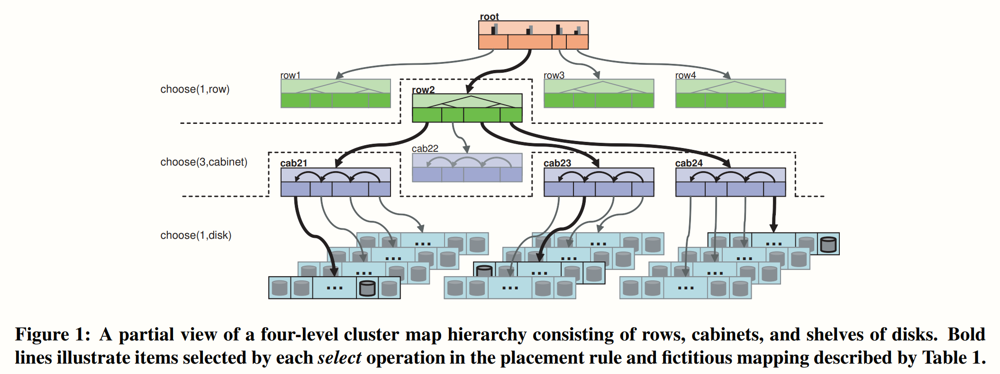
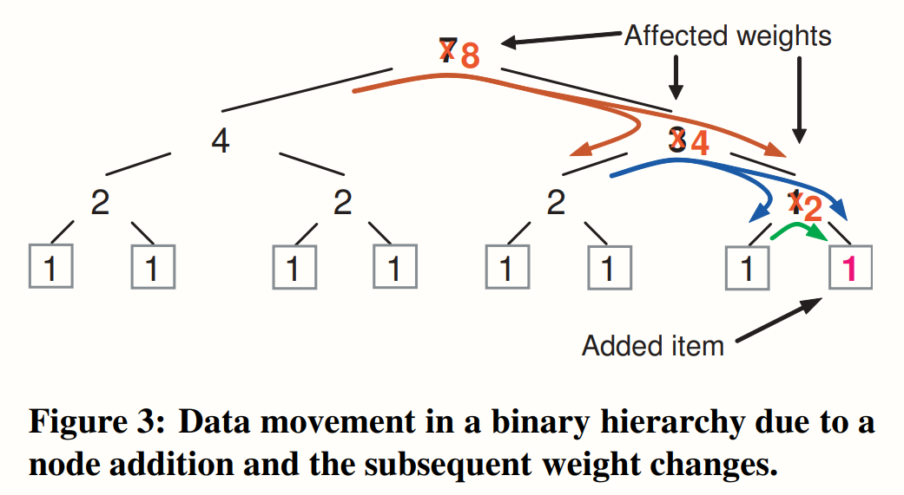
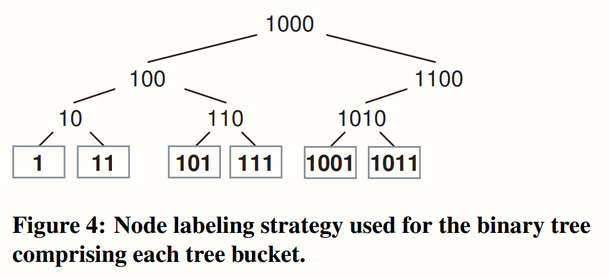

# CRUSH: Controlled, Scalable, Decentralized Placement of Replicated Data

## Abstract

CRUSH 是一个可扩展的伪随机数据分布函数，专为基于对象的分布式存储系统而设计，可有效地将数据对象映射到存储设备，而无需依赖中央目录。因为大型系统本质上是动态的，所以 CRUSH 旨在简化存储的添加和删除，同时最大限度地减少不必要的数据移动。

## 1 Introduction

在基于对象的存储系统中，每个文件的数据通常被条带化（strip）分布在整个系统集群中。对象在多个设备上被复制（或者采用别的冗余方法）以在出现故障时防止数据丢失。基于对象的存储系统通过使用小的对象列表来代替大的块列表，并且分散了低级块的分配问题，以简化数据布局。最根本的问题：如何在成千上万台存储设备（往往具有不同的性能和容量）之间分发数据。  
CRUSH（可扩展哈希下的受控复制），这是一种伪随机数据分发算法，能够高效、稳定地在异构、结构化存储集群中分发对象副本。CRUSH 被实现为伪随机的确定性函数，它将输入值（通常是对象或对象组标识符）映射到存储对象副本的设备列表。

## 2 Related Work

略。

## 3 The CRUSH algorithm

CRUSH 算法基于每个设备的权重来将数据分配到存储设备中，近似为均匀地概率分布。该分布由分层的集群图控制，该集群图表示可用的存储资源，并由构建该集群的逻辑元素组成。给定一个整数输入值 x，CRUSH 将输出 n 个不同存储目标的有序列表 R。

### 3.1 Hierarchical Cluster Map

集群图由设备和桶组成，两者都有数字标识符和权重值。存储桶可以包含任意数量的设备或其他存储桶，允许它们在存储层次结构中形成内部节点，其中设备始终位于叶子位置。

### 3.2 Replica Placement

CRUSH 设计用以在加权设备间均匀地分布数据，来保持存储和设备带宽资源使用的负载均衡。副本在层次结构中所放置的位置对数据安全也有重要影响。例如，物理接近性、共享电源和共享网络。通过将这种信息编码到集群图中，CRUSH 可以确保数据副本位于不同机架、电源、控制器或物理位置中的设备上。

#### 3.2.1 Collisions, Failure, and Overload

发生故障或过载的设备在群集图中被相应地标记，但被留在层次结构中以避免不必要的数据移动。CRUSH 通过使用集群图中指定的概率进行伪随机拒绝，选择性地分散过载设备数据的一部分。

#### 3.2.2 Replica Ranks

在主副本复制方案中，在出现故障后，通常希望以前的副本(已经有数据副本)成为新的主副本目标。在这种情况下，CRUSH 可以使用通过使用`r'= r+f`重新选择“前 n 个”合适的目标，其中 f 是目前 select(n,t)尝试的放置失败的次数。

### 3.3 Map Changes and Data Movement

加或删除存储资源。CRUSH 算法映射过程使用聚类图作为加权分层决策树，可以产生超出理论最优值的额外数据移动。在层次结构的每一层层次上，当相对子树权重的变化改变了分布时，一些数据对象必须从权重减少的子树移动到权重增加的子树。因为层次结构中每个节点上的伪随机放置决策在统计上是独立的，所以移动到子树的数据在该点下均匀地重新分布，并且不一定被重新映射到最终导致权重变化的叶项。只有在放置过程的后续级别（更深层次的）级别上，（通常是不同的）数据会被移动以保持正确的总体相对分布。图 3 中的二进制层次结构的情况说明了这种一般效果。  
层次中数据移动量有一个下限，这是将留在新添加设备的权重为的数据的占比。数据的移动量会随着层次结构的高度增加，渐进上界为。当相对于较小时，移动量接近这个上界，因为在递归的每一步移动到子树中的数据对象被映射到相对权重较小的项的概率非常低。

### 3.4 Bucket Types

CRUSH 定义了四种不同的桶来表示集群层次结构中的内部(非叶)节点：统一桶 uniform buckets、列表桶 list buckets、树桶 tree buckets 和稻草桶 straw buckets。

#### 3.4.1 Uniform Buckets

在大型系统中，设备很少单独添加。相反，新存储通常部署在相同设备的块中，通常作为服务器 rack 中的附加 shelf，或者作为整个 cabinet。达到使用寿命的设备通常会作为一个整体退役(个别故障除外)，这使得将它们作为一个单元来处理变得很自然。在这种情况下，CRUSH 的 uniform bucket 被用来代表一组相同的设备。这样做的关键优势是与性能相关的：CRUSH 可以在恒定的时间内将复制副本映射到统一的桶中。在均匀性限制不合适的情况下，可以使用其他桶类型。  
给定一个 CRUSH 输入值 x 和一个副本数 r，我们使用函数`c(r，x) = (hash(x)+ rp)mod m`从一个大小为 m 的 uniform bucket 中选择一个项，其中 p 是一个随机（但确定性）选择的大于 m 的素数。对于任何 r ≤ m，我们可以使用一些简单的数论引理证明我们总是来选择一个不同的项。对于 r > m，这个保证不再成立，这意味着具有相同输入 x 的两个不同的副本 r 可能得到相同的项目。在实践中，这只意味着放置算法的碰撞非零概率和随后的回溯。  
如果统一桶的大小发生变化，设备之间就会对数据进行完整的重新洗牌，就像传统的基于散列的分布策略一样。

#### 3.4.2 List Buckets

它的结构是链表结构，所包含的 item 可以具有任意的权重。CRUSH 从表头开始查找副本位置，它先得到表头 item 的权重 Wh，然后和剩余所有节点权重之和 Wr 做比较，然后根据 hash（x, r, item）得到一个［0 ～ 1］值 v，如果 v 在［0 ～ Wh/Wr］，则副本在表头 item 中，并返回 item 的 id，否则继续遍历剩余的链表。这个方法是从 RUSHp 算法中演变过来的，将数据分布问题转变为“most recently added item， or older items”。这种方法对于总是有新节点加入的情况很有好处，但当有节点从中间或者尾部删除时，就会带来一些数据迁移。这也和它的计算方法有关系，如果从尾部删除一个节点后，Wr 的值回发生变化，所以 ratio 的值也会发生变化。使用这种 bucket 会使得数据要么存储在新加入的节点上，要么就还保留在原来老的地方。  
List Bucket 的查找复杂度为 O（n），所以只适用于规模比较小的集群。

#### 3.4.3 Tree Buckets

该方法是从 RUSHt 演化过来的，主要是为了解决规模比较大的环境，查找复杂度 O(logn)。Tree buckets 中的元素被组织成一个加权的二叉查找树，所有的项都位于叶子节点。每一个内部节点都知道他左右子树的权重，并且按照固定的策略打上标签。当需要从 bucket 众选出一项时，CRUSH 从 root 节点开始查找副本的位置，它先得到节点的左子树的权重 Wl，得到节点的权重 Wn，然后根据 hash(x, r, node_id)得到一个[0~1]的值 v，假如这个值 v 在[0~Wl/Wn]中，则副本在左子树中，否则在右子树中。继续遍历节点，直到到达叶子节点。Tree Bucket 的关键是当添加删除叶子节点时，决策树中的其他节点的 node_id 不变。二叉树中节点的 node_id 的标识是根据对二叉树的中序遍历来决定的(node_id 不等于 item 的 id，也不等于节点的权重)。  
二叉树的节点的标签方法使用的是一个简单固定的方法，以避免树中有节点增加或者节点减少而导致节点标签的变化。这个规则很简单：

1. 树中最左侧的叶子节点永远是 1
2. 每次树增长的时候都会产生一个的新的根节点，之前的根节点会变成新根节点的左孩子。新的根节点的标签等于老的根节点的标签向左移一位（1，10，100，etc）。树的右侧的标签会复制左侧节点的标签并在最左侧在加上一个 1。  
   tree bucket 在查询性能上相比于 list 要好，而且数据迁移的控制也比较好。当一个节点发生变化时，只会导致节点所在子树上发生数据迁移。
   

#### 3.4.4 Straw Buckets

列表桶和树桶的结构是，需要计算有限数量的哈希值，并与权重进行比较，以选择一个桶项。在这样做的时候，它们以一种赋予某些项目优先级的方式进行划分和征服（例如，那些位于列表开头的项目），或者完全无需考虑项目的整个子树。这提高了副本放置过程的性能，但当桶的内容由于添加、删除或重新加权项目而改变时，也可能引入次优重组行为。  
这种类型让 Bucket 所包含的所有 item 公平的竞争(不像 list 和 tree 一样需要遍历)。这种算法就像抽签一样，所有的 item 都有机会被抽中(只有最长的签才能被抽中)。每个稻草的长度基于项目的权重的三次方用 f（wi）进行调整，这样权重较重的项目更有可能赢得抽签。每个签的长度是由 f(Wi)_hash(x, r, i) 决定的，Wi 是 item i 的权重，i 是 item 的 id 号。c(r, x) = MAX(f(Wi) _ hash(x, r, i))。目前，这种 Bucket 是 Ceph 默认使用的 Bucket，所以它也是经过大规模测试的，稳定性较好。虽然它的查询性能不如 List 和 Tree，但它在控制数据迁移方面是最优的。
