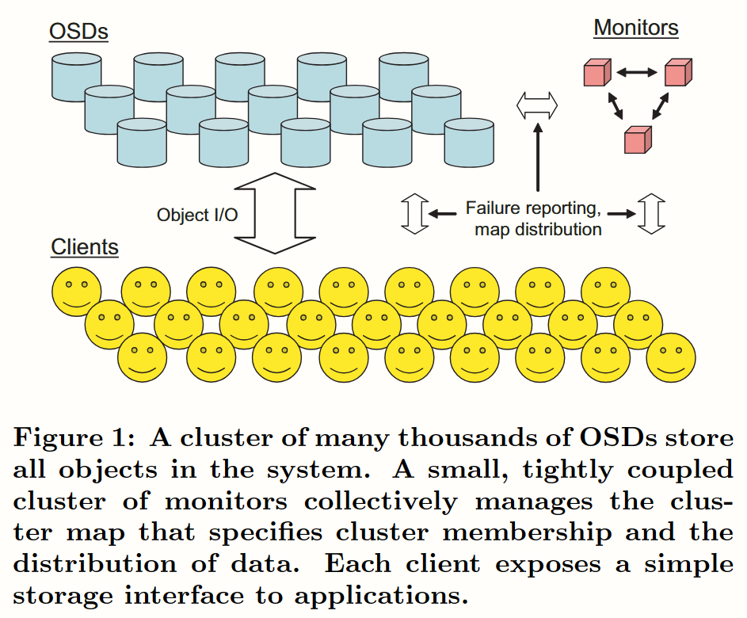
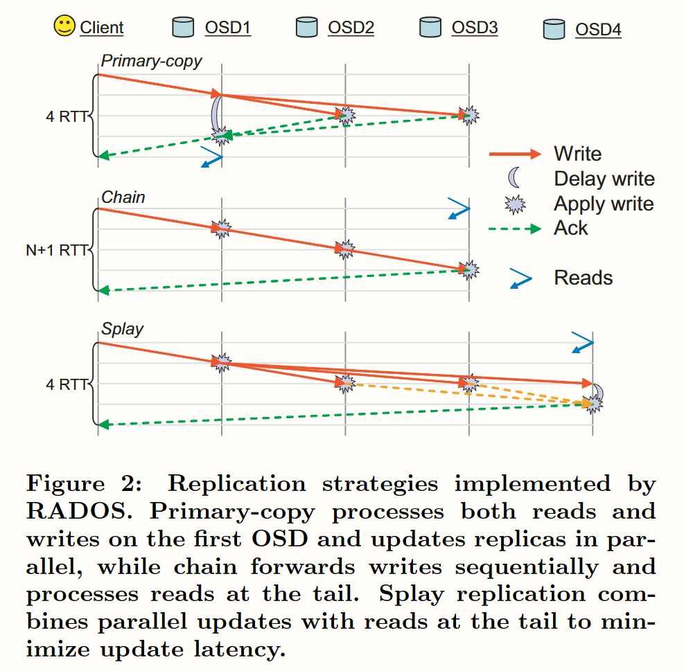

# RADOS: A Scalable, Reliable Storage Service for Petabyte-scaleStorage Clusters
## Abstract
RADOS是一个可靠的对象存储服务，它可以通过利用单个存储节点中的智能从而扩充到大量的设备。RADOS保留了一致的数据访问和强大的安全语义，同时允许节点通过使用小型集群图半自动地自我管理复制、故障检测和故障恢复。
## 1 Introduction
为Ceph分布式文件系统的一部分，RADOS促进了数据和工作负载在动态异构存储集群中的不断发展、平衡的分布。
## 2 SCALABLE CLUSTER MANAGEMENT

RADOS系统由大量的OSD和一小组负责管理OSD集群成员的监视器组成(图 1)。每个OSD包括一个CPU、一些易失性RAM、一个网络接口和一个本地连接的磁盘驱动器或RAID。监视器是独立的进程，需要少量的本地存储。
### 2.1 Cluster Map
集群图（cluster map）指定了哪些OSD在集群中，并且简洁地指定了系统中所有数据在这些设备上的分布。集群图被每个存储节点以及与RADOS集群交互的客户端复制。每当一个OSD的状态改变或者其他影响到数据分布的时间导致集群图改变时，该图的epoch就增加。集群图的更新被分解成增量映射：描述两个连续epoch之间差异的小型消息。
### 2.2 Data Placement
RADOS使用了一种数据分发策略（详见CRUSH），将对象伪随机地分发给设备。当新的存储设备增加到系统，现有数据的随机子样本会被迁移到新的设备来恢复平衡。
### 2.3 Device State
集群图包括了有关于数据分布在其中的设备的描述和当前的状态。这包括当前在线且可达（up）的所有OSD的当前网络地址，以及哪些设备当前关闭（down）的提示。
### 2.4 Map Propagation
每个OSD维护过去的集群图的增量更新的历史，用自己最新的epoch标记自己的所有消息，并且跟踪每个peer上观察到的最新的epoch。如果一个OSD收到持有旧的epoch的peer的信息，它将共享必要的增量以使该对等体同步。同样，当主动联系一个持有旧的epoch的对等体时，增量更新被先共享。为故障检测而定期交换的心跳消息确保了更新的快速传播，对于n个OSD的集群来说，更新在O(log n)时间内完成。
## 3 INTELLIGENT STORAGE DEVICES
集群映射中封装的数据分布知识允许RADOS将数据冗余、故障检测和故障恢复的管理分配给组成存储集群的OSD。这通过在高性能集群环境中利用类似点对点的协议来利用OSD中的智能。
### 3.1 Replication

RADOS实现了三种复制的策略。主拷贝（primary copy），链式（chain）和一个我们称之为splay的混合方式。在所有情况下，客户端将I/O操作发送到单个OSD，并且群集确保副本被安全地更新，并且保持一致的读/写语义(即可串行化)。所有副本更新后，将向客户端返回一个确认信息。
### 3.2 Strong Consistency
所有的消息都标有发送方的map epoch，以确保以完全一致的方式应用所有更新操作。
### 3.3 Failure Detection
RADOS采用异步、有序的点对点消息传递库进行通信。存储节点与其对等节点(与它们共享PG数据的OSD)定期交换心跳消息，以确保检测到设备故障。发现自己标记为down的OSD只需同步到磁盘，然后自我销毁，以确保一致的行为。
### 3.4 Data Migration and Failure Recovery
OSD积极地复制PG日志及其关于PG的当前内容包含的对象版本。
#### 3.4.1 Peering
负责一个PG的所有非primary的OSD给primary发消息，包含最近的更新、PG 日志的界限等信息。通过这些信息primary就能确定所有与PG有关的OSD，获取日志信息，确定该PG应当包含什么内容，并由此恢复数据。
#### 3.4.2 Recovery
与任何单个故障设备共享的副本分布在许多其他OSD上，每个PG将独立选择一个替代品，允许复制到更多的OSD。
## 4 MONITORS
一个小型的监控器集群存储集群图的主副本，并且针对配置改变或者OSD状态的改变做定期的更新，以此来管理存储系统。
### 4.1 Paxos Service
该集群基于基于Paxos的分布式状态机服务，其中集群图是当前的机器状态，并且每次成功的更新都会产新的集群图时期（epoch）。
### 4.2 Workload and Scalability
在一般情况下，Monitors做的工作很少：大多数map分发是由存储节点处理的，并且设备状态的改变（如设备故障）通常很少。